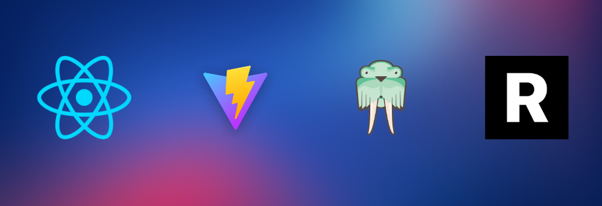

### Date: 6/29/2023

#### By: Michael Lackey

#### [Website](https://michaellackey.com/) | [GitHub](https://github.com/NobodysLackey) | [LinkedIn](https://www.linkedin.com/in/michaelglackey/)
***

### ***Description***

##### A React site for students showcasing React Router and APIs.

##### The app was deployed and can be viewed [here](https://rawg-router.surge.sh/).

***

### ***Technologies Used***

***

### ***Getting Started***

##### Search for any game you can think of to display results. Click on any game to view a  details page.

***

### ***Screenshots***

  <pre>
    &nbsp;&nbsp;&nbsp;&nbsp;&nbsp;&nbsp;
  </pre>

***

### ***Future Updates***

- [ ] Make the app scale for multiple sized screens
- [ ] More fleshed out nav
- [ ] More fleshed out details page

***

### ***Credits***

- [RAWG](https://rawg.io/)

***
